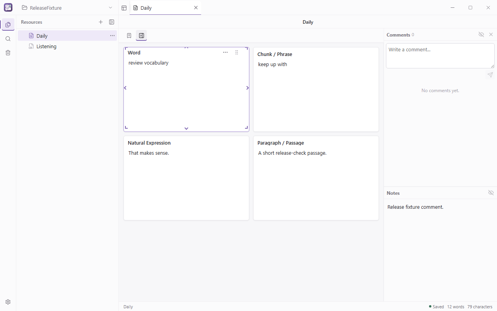

# PhraseFrame

[简体中文](README.md) · [Download the latest Windows beta](../../releases)

PhraseFrame is a local-first Windows desktop application for
language notes. It combines multi-tab text and media cards, modular rich-text
editing, notes and comments, local full-text search, and recoverable trash
without requiring a cloud account.

## Download

Download the latest prerelease from [GitHub Releases](../../releases):

- Use the NSIS `Setup.exe` for a normal installation.
- Use the MSI package for managed or administrator-oriented deployment.
- Verify the downloaded file with `SHA256SUMS.txt` from the same release.

The current beta is not code-signed. Windows SmartScreen may display an
unknown-publisher warning. Confirm that the download came from this repository
and verify its SHA-256 checksum.

## Data and privacy

- You choose the local workspace; notes do not require a cloud account.
- The application includes no telemetry, advertising analytics, or
  application-operated cloud sync.
- The search index can be rebuilt from workspace files.
- Uninstalling the application does not delete a user-selected workspace.

See the [Privacy Notice](PRIVACY.md) for details.

## Known limitations

- Only Windows x64 is currently supported and tested.
- Do not edit one workspace from multiple application instances.
- External media references depend on the original file path.
- Beta software may contain defects; keep an independent backup of important
  workspaces.

## Feedback

Use [Issues](../../issues) for bug reports and suggestions. Do not upload a
complete workspace containing private notes, real media, or personal paths.
Report security problems privately as described in [SECURITY.md](SECURITY.md).

## License

PhraseFrame Free Beta is proprietary software. Free of charge does
not mean open source. Installing or using it means accepting the
[Free Beta License Agreement](EULA.txt). Application source code is not
distributed by this repository.

Copyright © 2026 PhraseFrame. All rights reserved.
